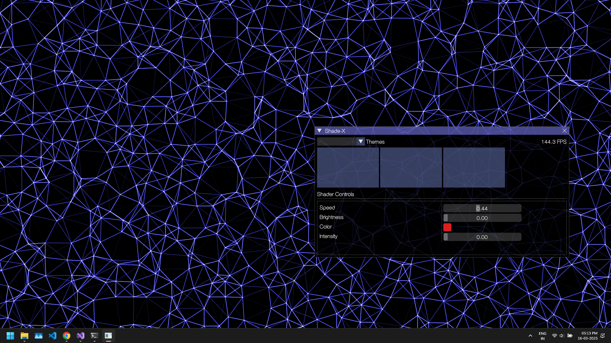
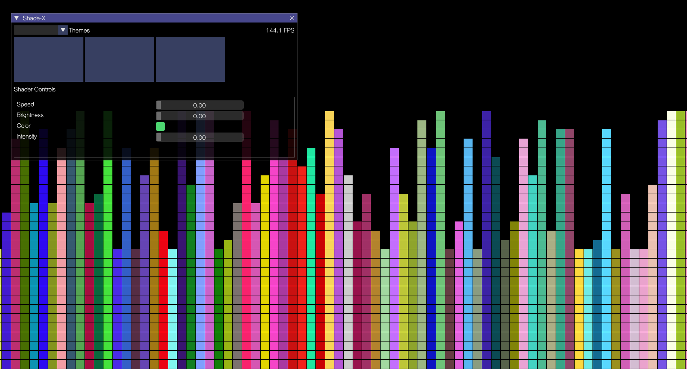

# Shade-X 🚀 *(In Progress)*  

**Shade-X** is a **Free and Open Source (FOSS)** OpenGL-based application that allows you to render **GLSL shaders** as your desktop wallpaper.  

## 📸 Screenshots  

  
  

  

## ⚠️ Project Status: Work in Progress  
This project is currently being developed by me after office hours and weekends.  

## 📌 Completed Features  
- Render **GLSL shaders** dynamically on a GLFW window.
- Save & load shader configurations.  
- Interactive **ImGui-based UI** for shader management.
- Shader configurations by modifying Uniforms in runtime.

## 📌 In-Progress or Pending Features
- Shader preview on the ImGui buttons.
- Set shader window as windows wallpaper.
- Multiple monitor support.
- Performance enhancement and polishing.

## 📂 Installation & Usage *(Coming Soon)*  
Installation instructions will be provided once the project reaches a stable state.  

## 📜 License  
*(To be added later)*  
